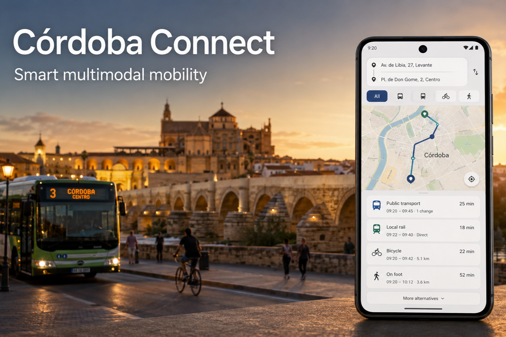

# Córdoba Connect



Córdoba Connect is an Android mobility companion for planning recurring journeys across
Córdoba, Spain. It combines public transport, walking and cycling in one bilingual app,
renders each itinerary on a map and keeps frequently used journeys available offline.

This repository contains the Córdoba Connect 1.0 hackathon submission: the Android app,
the FastAPI routing facade and the Docker-based OpenTripPlanner infrastructure.

## Highlights

- Multimodal planning with AUCORSA buses, Renfe Proximidad, walking and cycling.
- Google Places address search and the device's current location as an origin.
- Immediate and scheduled departures with clear transfer, stop, wait and walking details.
- Route maps with distinct styling for walking, bus, rail and bicycle segments.
- Active-mobility recommendations when walking or cycling is competitive with transit.
- Saved journeys classified as workday or weekend trips.
- Encrypted offline storage using Room, SQLCipher and Android Keystore.
- Optional synchronization through Firebase Authentication, Firestore and App Check.
- English and Spanish interfaces.

## How it works

The Android client sends a journey request to the local FastAPI service. FastAPI validates
the request and queries OpenTripPlanner, which plans against the Córdoba OpenStreetMap
extract and the prepared AUCORSA/Renfe GTFS datasets. The client then presents the
alternatives and stores selected journeys locally, with optional Firestore synchronization.

| Component | Technology | Responsibility |
| --- | --- | --- |
| Android | Kotlin, Jetpack Compose, Room, SQLCipher | Search, maps and saved journeys |
| Maps | Google Maps and Places SDKs | Address selection and route visualization |
| API | Python 3.12 and FastAPI | Stable journey API and OTP adapter |
| Router | OpenTripPlanner 2.9 | Multimodal itinerary calculation |
| Data | OpenStreetMap, AUCORSA GTFS and Renfe GTFS | Córdoba street and transit network |
| Cloud sync | Firebase Auth, Firestore and App Check | Per-installation journey backup |

## Android app

The app supports Android 8.0 and newer (`minSdk 26`), targets Android 16 (`targetSdk 36`)
and is built with JDK 21. A signed Córdoba Connect 1.0 APK can be attached to the GitHub
Release for direct installation. Android will ask users to allow installation from the
browser or file manager used to download it.

To build from source, install Android Studio with SDK Platform 37.1 and Build Tools 36.0.0.
Create the ignored `local.properties` file from the safe template:

```powershell
Copy-Item local.defaults.properties local.properties
```

Keep the generated `sdk.dir` entry and add your Android-restricted Google Maps/Places key:

```properties
GOOGLE_MAPS_API=YOUR_ANDROID_MAPS_KEY
API_BASE_URL=http://10.0.2.2:8000
FIREBASE_SYNC_ENABLED=false
```

`10.0.2.2` reaches the host computer from the Android emulator. For wireless or USB
debugging on a physical device, connect the phone and computer to the same local network,
use the computer's private IPv4 address (for example `http://192.168.1.157:8000`) and allow
Python through Windows Firewall on private networks. The backend start script displays the
detected physical-device endpoint. Local HTTP is accepted only by debug builds; a release
build must use a deployed HTTPS API.

## Run the routing stack

### Requirements

- Docker Desktop with Docker Compose
- Python 3.12
- PowerShell
- Android Studio and JDK 21

Docker is required for the OpenStreetMap extraction and OpenTripPlanner scripts. Start
Docker Desktop before using anything under `infra\osm` or `infra\otp`.

Create the backend environment once:

```powershell
py -3.12 -m venv backend\.venv-win
.\backend\.venv-win\Scripts\python.exe -m pip install -e "backend[dev]"
```

### Prepare the routing data

These steps are required on first setup and whenever the OSM or GTFS inputs change. Place
the Andalucía `.osm.pbf` input in the repository root and follow [data/README.md](data/README.md)
for the projected AUCORSA dataset.

```powershell
.\infra\osm\extract-cordoba.ps1
.\infra\otp\download-renfe-gtfs.ps1
.\infra\otp\prepare-data.ps1 -OsmPath .\data\raw\osm\cordoba.osm.pbf
.\infra\otp\build-graph.ps1
```

The scripts extract Córdoba, download the Renfe feed, assemble the routing inputs and build
the OTP graph inside Docker.

### Start the services

Start OpenTripPlanner in the first terminal:

```powershell
.\infra\otp\start.ps1
```

Start FastAPI in a second terminal:

```powershell
.\infra\backend\start.ps1
```

Run the `app` configuration from Android Studio on an emulator with Google APIs. When
finished, stop OpenTripPlanner with:

```powershell
.\infra\otp\stop.ps1
```

## Firebase synchronization

Cloud synchronization is optional and local storage remains the source available to the
UI when the device is offline. To enable it:

1. Register `com.example.routeplanning` as an Android app in your Firebase project.
2. Download its `google-services.json` to `app/google-services.json`. The file is ignored
   by Git; `app/google-services.example.json` is used only as a non-functional CI template.
3. Enable Anonymous Authentication and create a Firestore database.
4. Deploy the included per-user rules:

   ```powershell
   firebase deploy --only firestore:rules --project YOUR_PROJECT_ID
   ```

5. Register the debug and release signing certificates in Firebase App Check. Debug builds
   use the debug provider and release builds use Play Integrity.
6. Set `FIREBASE_SYNC_ENABLED=true` only in the ignored `local.properties` file.

Synchronized journeys are stored at:

```text
/users/{firebaseAuthUid}/savedCommutes/{journeyId}
```

Restrict the Maps key to the Android package and allowed signing SHA-1 fingerprints. Keep
Firebase access protected with Authentication, the included Firestore rules, App Check and
appropriate quotas. Never commit a service-account credential or signing keystore.

## Tests and continuous integration

Run the Android validation used by GitHub Actions:

```powershell
.\gradlew.bat testDebugUnitTest lintDebug assembleDebug assembleDebugAndroidTest
```

Run the backend checks with:

```powershell
.\backend\.venv-win\Scripts\python.exe -m ruff check backend
.\backend\.venv-win\Scripts\python.exe -m pytest backend
```

The CI workflow builds Android with non-functional Firebase and Maps placeholders, so no
production credential is required or stored in GitHub.

## Data scope

The current urban bus graph uses a clearly identified weekly projection of the available
AUCORSA schedule. Rail routing uses the downloaded Renfe schedule. Córdoba Connect does not
claim real-time bus arrival information because no reusable official AUCORSA real-time feed
is included in this submission.

Additional technical documentation is available in:

- [Backend](backend/README.md)
- [Oracle Cloud HTTPS deployment](deploy/oracle/README.md)
- [OpenTripPlanner infrastructure](infra/otp/README.md)
- [OpenStreetMap extraction](infra/osm/README.md)
- [Routing data](data/README.md)

## License

The Córdoba Connect source code is free software licensed under the
[GNU General Public License v3.0](LICENSE). Third-party dependencies and datasets remain
subject to their respective licenses and terms.
